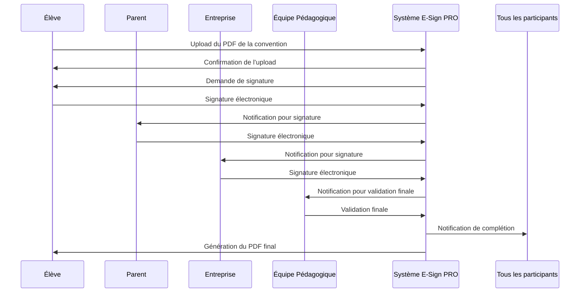
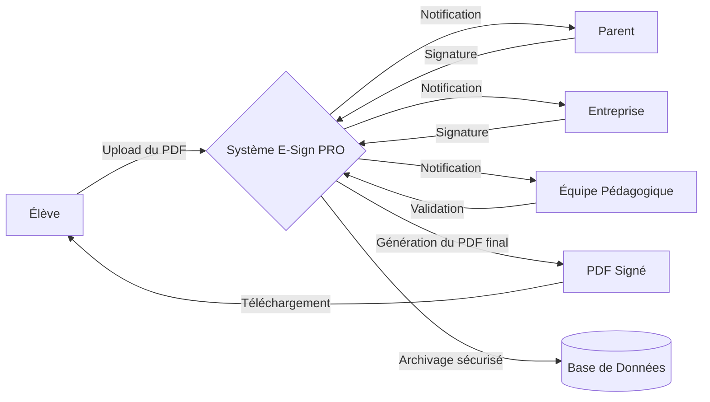

## **Charte de Projet : E-Sign PRO**

---

### **1. Objectifs du Projet**

**But :**  
Digitaliser et simplifier le processus de signature et d’archivage des conventions de stage pour les élèves, leurs responsables légaux, les entreprises et l’équipe éducative.

**Objectifs SMART :**
1. **Spécifique :** Créer une plateforme web permettant l’upload, la signature électronique séquencée et l’archivage sécurisé des conventions de stage.
2. **Mesurable :** Livrer un MVP fonctionnel d’ici le 28 février, avec au moins 90 % des fonctionnalités clés opérationnelles.
3. **Atteignable :** Utiliser des technologies modernes et accessibles (React, Node.js, SQLite) pour garantir un développement rapide et efficace.
4. **Réaliste :** Respecter le calendrier prévu en répartissant les tâches entre les membres de l’équipe.
5. **Temporel :** Achever le projet en 3 mois, avec des jalons clairs à chaque étape.

---

### **2. Parties Prenantes et Rôles**

**Parties prenantes :**
- **Interne :**
  - **Enes** : Responsable Backend et Intégration des données.
  - **Salomon** : Responsable Frontend et Expérience Utilisateur.
- **Externe :**
  - **Élèves** : Utilisateurs finaux qui téléchargent et signent les conventions.
  - **Parents** : Signataires des conventions.
  - **Entreprises** : Signataires des conventions.
  - **Équipe pédagogique** : Validation finale des conventions.

**Rôles de l’équipe :**
- **Enes :**
  - Conception des APIs.
  - Gestion des bases de données.
  - Intégration des fonctionnalités principales (upload, signatures).
- **Salomon :**
  - Conception de l’interface utilisateur.
  - Gestion de l’accessibilité multiplateforme.
  - Mise en place d’une interface fluide et intuitive.

---

### **3. Périmètre du Projet**

**Inclus (In-Scope) :**
- Upload et gestion des fichiers PDF.
- Signature électronique séquencée.
- Génération du document final avec toutes les signatures.
- Notifications par e-mail ou SMS pour chaque étape.
- Archivage sécurisé conforme au RGPD.

**Exclus (Out-of-Scope) :**
- Intégration avec d’autres systèmes (ex : Pronote) dans cette phase.
- Fonctionnalités avancées comme la gestion des paiements ou des contrats complexes.

---

### **4. Risques et Stratégies d’Atténuation**

| **Risque**                          | **Stratégie d’Atténuation**                                                                 |
|-------------------------------------|--------------------------------------------------------------------------------------------|
| Retards dans le développement       | Suivi rigoureux du calendrier avec des réunions hebdomadaires pour vérifier l’avancement.  |
| Problèmes de sécurité des données   | Utilisation de JWT pour l’authentification et chiffrement des données sensibles.           |
| Manque d’expérience avec les outils | Planification de sessions de formation ou tutoriels pour les membres de l’équipe.          |
| Bugs dans l’interface utilisateur   | Tests utilisateurs réguliers pour identifier et corriger les problèmes rapidement.         |

---

### **5. Plan de Haut Niveau**

**Timeline :**

| **Phase**              | **Date limite** | **Tâches principales**                           |
|-------------------------|-----------------|--------------------------------------------------|
| **Analyse initiale**    | 15 décembre     | Choix des outils et technologies.               |
| **Développement Backend** | 15 janvier      | APIs : Upload PDF, gestion des signatures.       |
| **Développement Frontend**| 31 janvier      | Interface : Formulaires, workflow utilisateur.   |
| **Intégration initiale**  | 15 février      | Mise en place du système complet pour tests.     |
| **Tests utilisateurs**  | 28 février      | Recueil des retours et correction des bugs.      |

---

### **6. Ressources et Technologies**

**Frontend :**
- **React.js** : Pour une interface utilisateur réactive et moderne.
- **Bootstrap/Tailwind CSS** : Pour un design rapide et professionnel.

**Backend :**
- **Node.js avec Express** : Pour une API légère et performante.
- **SQLite** : Pour le stockage des données.

**Génération PDF :**
- **PDFKit** : Pour créer et modifier des PDF.

**Hébergement :**
- **Railway** (Backend) et **Vercel** (Frontend) : Solutions gratuites et faciles à utiliser.

**Sécurité :**
- **JWT** pour l’authentification.
- **HTTPS** pour les connexions sécurisées.

---

### **7. Modalités de Communication**

- **Réunions virtuelles** : Pour faire le point sur l’avancement.
- **Plateforme collaborative** : Utilisation de **Trello** pour partager les tâches et les documents.

---

### **8. Livrables**

1. **Charte de Projet** : Ce document.
2. **MVP fonctionnel** : Une plateforme web permettant l’upload, la signature et l’archivage des conventions de stage.
3. **Documentation utilisateur** : Un guide ou une vidéo explicative pour les utilisateurs finaux.

---

### **9. Conclusion**

Ce projet vise à moderniser et simplifier un processus administratif crucial pour les élèves, les entreprises et les établissements scolaires. En suivant cette charte, nous nous assurons que toutes les parties prenantes sont alignées et que le projet est sur la bonne voie pour réussir.

## UML diagrams

flow chart:

