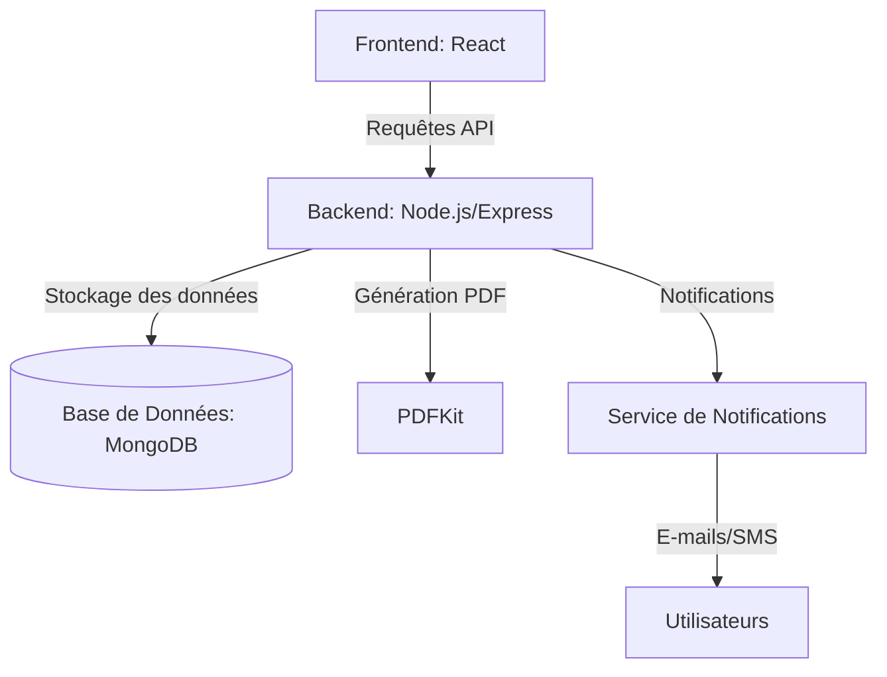
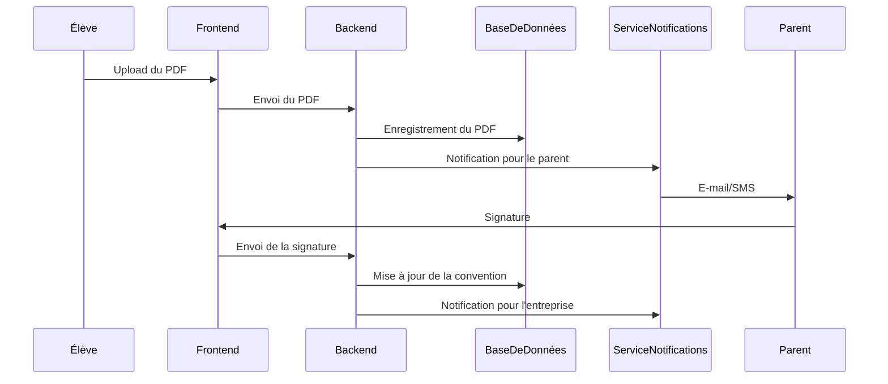

## **Documentation Technique : E-Sign PRO**

---

### **1. User Stories et Mockups**

**Objectif :** Décrire les fonctionnalités du MVP du point de vue de l'utilisateur et créer des maquettes pour l'interface utilisateur.

**User Stories :**
1. **En tant qu'élève**, je veux uploader une convention de stage pour qu'elle soit signée par les parties concernées.
2. **En tant que parent**, je veux recevoir une notification pour signer la convention de stage de mon enfant.
3. **En tant qu'entreprise**, je veux signer la convention de stage en ligne pour éviter les délais postaux.
4. **En tant qu'équipe pédagogique**, je veux valider la convention de stage une fois toutes les signatures obtenues.

**Priorisation (MoSCoW) :**
- **Must Have** : Upload, signature séquencée, notifications.
- **Should Have** : Archivage sécurisé, génération du PDF final.
- **Could Have** : Intégration avec Pronote.
- **Won't Have** : Gestion des paiements.

**Mockups :**
- **Maquette 1** : Page d'upload du PDF.
- **Maquette 2** : Interface de signature électronique.
- **Maquette 3** : Tableau de bord de suivi des conventions.

---

### **2. Architecture du Système**

**Objectif :** Décrire comment les composants du système interagissent.

**Diagramme d'Architecture :**

**Explication :**
- **Frontend** : Interface utilisateur en React.
- **Backend** : API en Node.js/Express pour gérer les requêtes.
- **Base de Données** : MongoDB pour stocker les conventions et les informations des utilisateurs.
- **PDFKit** : Pour générer les PDF signés.
- **Service de Notifications** : Envoi d'e-mails ou de SMS aux utilisateurs.

---

### **3. Composants, Classes et Base de Données**

**Objectif :** Décrire la structure interne du système.

**Classes Backend :**
- **User** : Gère les informations des utilisateurs (élèves, parents, entreprises).
- **Convention** : Stocke les données de la convention (PDF, signatures, statut).
- **Notification** : Gère l'envoi des notifications.

**Base de Données :**
- **Collection : Users**
  - `{ "id": 1, "name": "John Doe", "email": "john@example.com", "role": "élève" }`
- **Collection : Conventions**
  - `{ "id": 1, "file": "convention.pdf", "signatures": ["élève", "parent", "entreprise"], "status": "en cours" }`

---

### **4. Diagrammes de Séquence**

**Objectif :** Illustrer les interactions entre les composants pour les cas d'utilisation clés.

**Diagramme de Séquence : Signature d'une Convention**

---

### **5. Documentation des APIs**

**Objectif :** Décrire les APIs externes et internes.

**APIs Externes :**
- Aucune API externe utilisée pour ce MVP.

**APIs Internes :**
1. **Upload du PDF**
   - **URL** : `/api/upload`
   - **Méthode** : POST
   - **Input** : `{ "file": "PDF", "userId": 1 }`
   - **Output** : `{ "status": "success", "conventionId": 1 }`

2. **Signature Électronique**
   - **URL** : `/api/sign`
   - **Méthode** : POST
   - **Input** : `{ "conventionId": 1, "signature": "base64", "role": "parent" }`
   - **Output** : `{ "status": "success" }`

---

### **6. Stratégies SCM et QA**

**Gestion du Code Source (SCM) :**
- **Outil** : Git.
- **Branches** :
  - `main` : Version stable.
  - `develop` : Développement en cours.
  - `feature/*` : Branches pour chaque fonctionnalité.
- **Processus** :
  - Code reviews avant fusion dans `develop`.
  - Déploiement automatique sur Vercel (Frontend) et Railway (Backend).

**Assurance Qualité (QA) :**
- **Tests Unitaires** : Jest pour tester les APIs.
- **Tests d'Intégration** : Postman pour tester les workflows complets.
- **Tests Manuels** : Validation des fonctionnalités clés par l'équipe.

---

### **7. Justifications Techniques**

**Choix des Technologies :**
- **React** : Facile à utiliser pour une interface utilisateur réactive.
- **Node.js/Express** : Léger et adapté pour une API rapide.
- **MongoDB** : Flexible pour stocker des documents JSON.
- **PDFKit** : Simple à intégrer pour générer des PDF.
- **JWT** : Sécurise l'authentification des utilisateurs.

---

### **8. Conclusion**

Cette documentation technique fournit un **blueprint complet** pour le développement du MVP d'**E-Sign PRO**. Elle décrit les fonctionnalités, l'architecture, les interactions, et les stratégies de gestion du code et de qualité. En suivant ce plan, l'équipe peut développer le projet de manière structurée et efficace.
